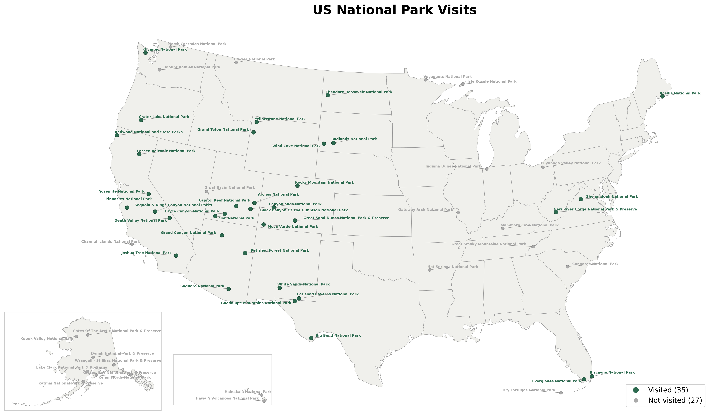
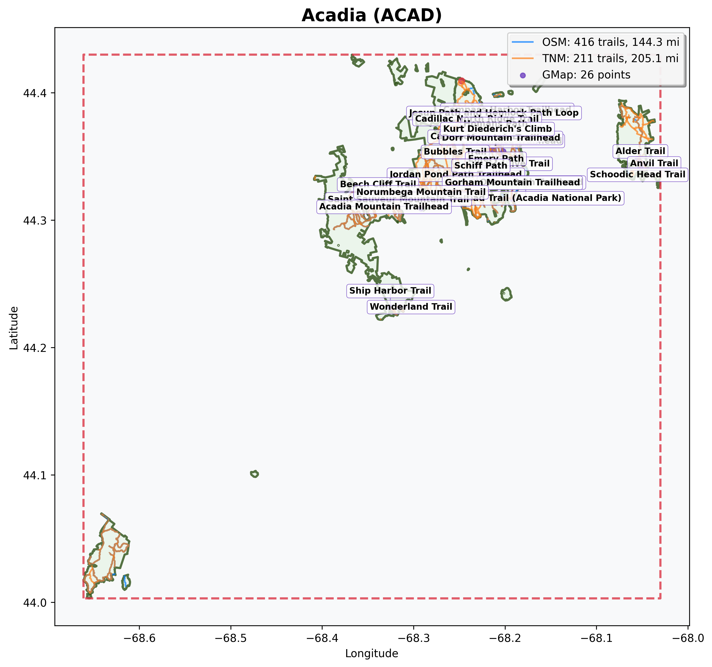

# Using the API

This tutorial walks through the API's capabilities, starting with a broad overview of your parks and progressively narrowing down to individual trail visualizations. By the end, you'll know how to query parks and trails, generate visualizations, and build a 3D elevation profile for a specific trail.

The tutorial assumes you've completed the [Getting Started](getting-started.md) guide, run the full data collection pipeline, and have both Docker services running.

The examples below use `curl` with `python3 -m json.tool` for pretty-printed output. You can also paste the URLs directly into your browser, which is especially useful for the visualization endpoints that return images and interactive HTML.

> **Tip:** Don't want to set up locally? You can try the data query endpoints on the [live demo](https://seanangio-nps-hikes.onrender.com/docs). In the examples below, replace `http://localhost:8000` with `https://seanangio-nps-hikes.onrender.com`. Note that visualization endpoints (maps, elevation charts, etc.) are only available locally.

## Orient yourself

First, confirm that the API is running and that the database is connected:

```bash
curl http://localhost:8000/health | python3 -m json.tool
```

You should see:

```json
{
    "status": "healthy",
    "database": "connected"
}
```

The root endpoint lists all available endpoints:

```bash
curl http://localhost:8000/ | python3 -m json.tool
```

```json
{
    "name": "NPS Trails API",
    "version": "1.0.0",
    "description": "Query National Park trail data from OpenStreetMap and The National Map",
    "documentation": {
        "swagger_ui": "/docs",
        "redoc": "/redoc",
        "openapi_json": "/openapi.json"
    },
    "endpoints": {
        "parks": "/parks",
        "trails": "/trails",
        "us_static_park_map": "/parks/viz/us-static-park-map",
        "us_interactive_park_map": "/parks/viz/us-interactive-park-map",
        "static_map": "/parks/{park_code}/viz/static-map",
        "elevation_matrix": "/parks/{park_code}/viz/elevation-matrix",
        "trail_3d_viz": "/parks/{park_code}/trails/{trail_slug}/viz/3d",
        "health_check": "/health"
    }
}
```

> **Tip:** For a full interactive reference, open [http://localhost:8000/docs](http://localhost:8000/docs) in your browser. The Swagger UI lets you try every endpoint, inspect request/response schemas, and experiment with query parameters.

## Browse your parks

The `/parks` endpoint returns a `park_count`, a `visited_count`, and a `parks` array. Each park includes its 4-letter code, name, state, coordinates, and NPS URL.

```bash
curl http://localhost:8000/parks | python3 -m json.tool
```

To see only the parks from your visit log, add the `visited` filter:

```bash
curl "http://localhost:8000/parks?visited=true" | python3 -m json.tool
```

```json
{
    "park_count": 3,
    "visited_count": 3,
    "parks": [
        {
            "park_code": "acad",
            "park_name": "Acadia National Park",
            "full_name": "Acadia National Park",
            "designation": "National Park",
            "states": "ME",
            "latitude": 44.3386,
            "longitude": -68.2733,
            "url": "https://www.nps.gov/acad/index.htm",
            "visit_month": "Oct",
            "visit_year": 2024
        },
        ...
    ]
}
```

Visited parks include `visit_month` and `visit_year` from your visit log. Flip the filter to see your park bucket list:

```bash
curl "http://localhost:8000/parks?visited=false" | python3 -m json.tool
```

For richer responses, add `include_description=true` to include the full NPS description for each park:

```bash
curl "http://localhost:8000/parks?visited=true&include_description=true" | python3 -m json.tool
```

## See the big picture

The API can serve map visualizations of all your parks. These endpoints return pre-generated images, so you need to generate them first. Run the US park map profiling module:

```bash
POSTGRES_HOST=localhost POSTGRES_PORT=5433 python profiling/orchestrator.py us_park_map
```

Now open the static map in your browser:

```
http://localhost:8000/parks/viz/us-static-park-map
```

This returns a PNG image showing all national parks on a US map with Alaska and Hawaii insets. Parks are color-coded by your visit log.



For an interactive version with hover tooltips and park boundaries, open:

```
http://localhost:8000/parks/viz/us-interactive-park-map
```

This returns an HTML page with a zoomable Plotly map. Hover over any park to see its name, state, and visit status. You can zoom in to see (rough) park boundary outlines.

## Park-level visualizations

The API also serves per-park trail maps and elevation charts. Generate them with:

```bash
POSTGRES_HOST=localhost POSTGRES_PORT=5433 python profiling/orchestrator.py visualization usgs_elevation_viz
```

> **Note:** The `visualization` module generates static trail maps for every park with trail data. The `usgs_elevation_viz` module generates elevation matrices for parks with elevation data. Depending on how many parks have data, this may take a few minutes.

### Static trail map

Open a trail map for a specific park using its 4-letter code:

```
http://localhost:8000/parks/acad/viz/static-map
```

This returns a PNG image showing the park boundary and all collected trails. Trails are color-coded by data source: blue for OpenStreetMap, orange for The National Map. Purple points mark hiking locations imported from your KML files.



> **Tip:** Replace `acad` with any park code to see its trail map (for example, `/parks/yose/viz/static-map` for Yosemite).

### Elevation matrix

For parks where you have matched trails with elevation data, there's an elevation profile matrix:

```
http://localhost:8000/parks/acad/viz/elevation-matrix
```

This returns a PNG grid of elevation charts, one per matched trail. Each chart shows distance on the x-axis and elevation on the y-axis, giving you a quick visual comparison across trails.


## Explore trails

The `/trails` endpoint returns trail data from both The National Map (TNM) and OpenStreetMap (OSM). Start by querying trails for a specific park:

```bash
curl "http://localhost:8000/trails?park_code=acad" | python3 -m json.tool
```

The response includes a `trail_count`, `total_miles`, and a `trails` array. Each trail includes:

| Field | Description |
|---|---|
| `trail_id` | Unique identifier (from TNM or OSM) |
| `trail_name` | Trail name |
| `source` | Data source (`TNM` or `OSM`) |
| `length_miles` | Trail length in miles |
| `hiked` | Whether you've hiked this trail (matched from your KML files) |
| `viz_3d_available` | Whether a 3D visualization can be generated |
| `viz_3d_slug` | URL slug for the 3D endpoint (if available) |

When querying a single park, results are sorted by length (longest first). When querying across multiple parks, results are sorted by park code and trail name.

> **Note:** The API deduplicates trails that appear in both data sources. When a TNM trail and an OSM trail in the same park share more than 70% name similarity, the API keeps the TNM version. This avoids double-counting while preferring the more detailed TNM data.

### Filter by data source

Compare what each data source provides:

```bash
curl "http://localhost:8000/trails?park_code=acad&source=TNM" | python3 -m json.tool
curl "http://localhost:8000/trails?park_code=acad&source=OSM" | python3 -m json.tool
```

### Filter by hiked status

See which trails you've hiked based on your KML data:

```bash
curl "http://localhost:8000/trails?hiked=true" | python3 -m json.tool
```

Or find trails you haven't hiked yet in a specific park:

```bash
curl "http://localhost:8000/trails?park_code=acad&hiked=false" | python3 -m json.tool
```

### Filter by length

Find trails within a specific length range:

```bash
curl "http://localhost:8000/trails?min_length=5&max_length=15" | python3 -m json.tool
```

### Filter by state

Query trails across all parks in a state:

```bash
curl "http://localhost:8000/trails?state=CA" | python3 -m json.tool
```

You can combine multiple states by repeating the parameter:

```bash
curl "http://localhost:8000/trails?state=CA&state=UT" | python3 -m json.tool
```

> **Note:** State parameters surface state data as returned from the NPS API, rather than geographic validation. Keep this in mind when querying trails in parks that span multiple states (Yellowstone for example).

## The 3D trail journey

The most detailed visualization in the API is an interactive 3D elevation profile for individual trails. Getting there takes a few steps because you need to discover which trails have elevation data and find their URL slugs.

### Find trails with 3D data

Start by filtering for trails with 3D visualizations available:

```bash
curl "http://localhost:8000/trails?park_code=acad&viz_3d=true" | python3 -m json.tool
```

In the response, look for the `viz_3d_slug` field on each trail:

```json
{
    "trail_count": 2,
    "total_miles": 5.8,
    "trails": [
        {
            "trail_id": "123456",
            "trail_name": "Jordan Pond Path",
            "park_code": "acad",
            "source": "TNM",
            "length_miles": 3.4,
            "hiked": true,
            "viz_3d_available": true,
            "viz_3d_slug": "jordan_pond_path"
        },
        ...
    ]
}
```

The `viz_3d_slug` value is what you need for the next step.

### Open the 3D visualization

Build the URL using the park code and trail slug, and open it in your browser:

```
http://localhost:8000/parks/acad/trails/jordan_pond_path/viz/3d
```

This opens an interactive 3D Plotly visualization. You can rotate, zoom, and pan the trail. The trail is color-coded by elevation using a terrain gradient (brown at lower elevations, cream in the middle, and blue-green at higher elevations). Hover over any point to see its distance along the trail and elevation.


### Adjust the vertical scale

By default, the z-axis is exaggerated by a factor of 5 to make elevation changes more visible. You can adjust this with the `z_scale` parameter (range: 1 to 20):

```
http://localhost:8000/parks/acad/trails/jordan_pond_path/viz/3d?z_scale=10
```

A higher value makes elevation changes more dramatic. A value of 1 shows true proportions, which can make trails appear nearly flat.

### What makes a trail eligible

Not every trail has a 3D visualization. A trail needs elevation data, which requires this chain:

1. You added a hiking point near the trail in your KML files.
2. The trail matching step matched that point to a trail geometry.
3. The elevation collection step sampled points along the trail and queried the USGS for elevations.

This is why your KML files matter. They determine which trails get elevation data and 3D visualizations.

> **Note:** Unlike the park maps and elevation matrices from the previous sections, 3D trail visualizations don't require the profiling step. The API generates them on-demand from the elevation data already in the database.

## Combine and discover

All the filters on the `/trails` endpoint can be combined. Here are a few queries that answer real questions:

**What long trails haven't I hiked in Utah?**

```bash
curl "http://localhost:8000/trails?state=UT&hiked=false&min_length=5" | python3 -m json.tool
```

**Which of my hiked trails have 3D visualizations?**

```bash
curl "http://localhost:8000/trails?hiked=true&viz_3d=true" | python3 -m json.tool
```

From there, pick any trail with a `viz_3d_slug` and open its 3D visualization in your browser.

> **Tip:** You can also use Python's `requests` library, the Swagger UI at `/docs`, or any HTTP client to query these endpoints.
