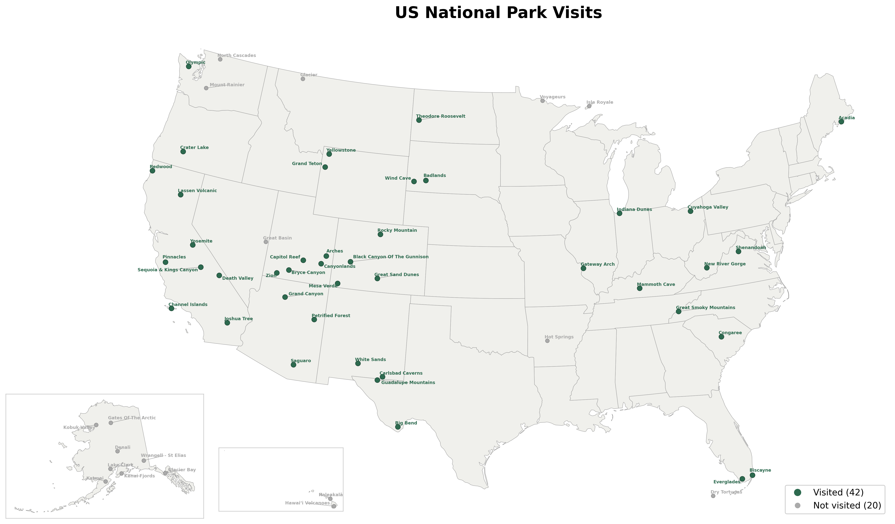
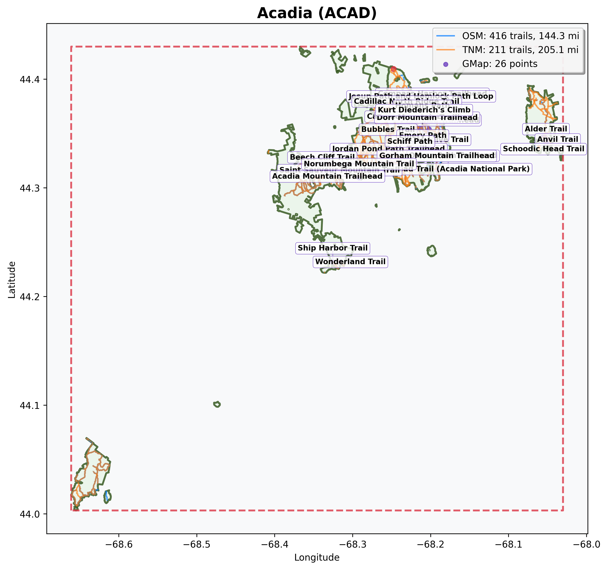
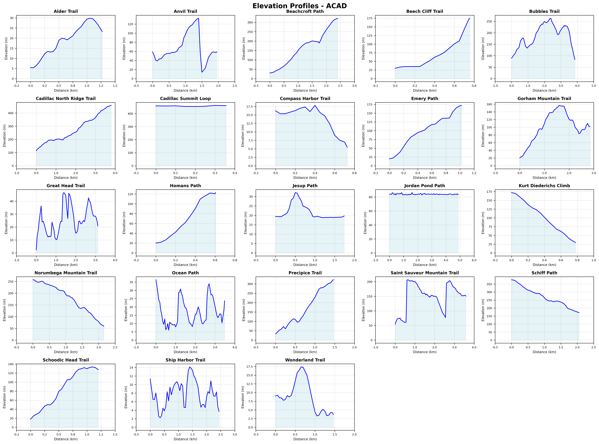
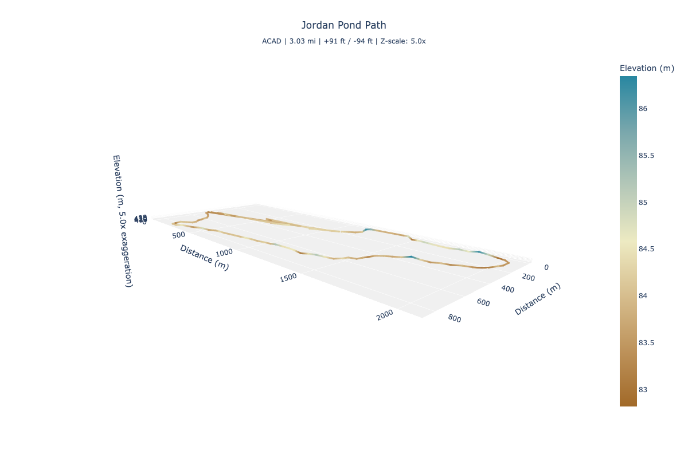

This tutorial walks through the API's capabilities, starting with a broad overview of your parks and narrowing to individual trail visualizations. By the end, you'll know how to query parks and trails, use semantic and hybrid search, generate visualizations, build a 3D elevation profile for a specific trail, and use natural language search.

The tutorial assumes you've completed the [Getting Started](getting-started.md) guide and run the full data collection pipeline. You can follow these examples in either local API mode:

- If you started the full Docker stack with `make up`, the API base URL is `http://localhost:8000`.
- If you are using the recommended day-to-day workflow with `make dev`, the API base URL is `http://localhost:8001`.

The examples below use `curl` with `python3 -m json.tool` for pretty-printed output. You can also paste the URLs directly into your browser, which is particularly useful for the visualization endpoints that return images and interactive HTML.

> **Tip:** The examples below use `http://localhost:8000` for brevity because that is the Docker API port. If you're running the API with `make dev`, replace `http://localhost:8000` with `http://localhost:8001`. If you want to use the live demo instead, replace `http://localhost:8000` with `https://seanangio-nps-hikes.onrender.com`. Note that visualization endpoints and the natural language query endpoint (`/query`) are only available locally.

## Python SDK

If you prefer working with Python objects instead of raw JSON, there is a [Python SDK](https://github.com/seanangio/nps-hikes-python-sdk) that wraps the 6 data endpoints. It gives you typed Pydantic models with IDE autocomplete, meaningful exceptions like `ParkNotFoundError`, and no need to construct URLs or parse JSON yourself.

```bash
pip install git+https://github.com/seanangio/nps-hikes-python-sdk.git
```

```python
from nps_hikes import Client

client = Client()

trails = client.get_trails(park_code="yose", min_length_mi=5.0)
for trail in trails.trails:
    print(f"{trail.trail_name}: {trail.length_miles} mi")
```

See the [SDK README](https://github.com/seanangio/nps-hikes-python-sdk#readme) for the full method reference, error handling, and configuration options.

## Orient yourself

To get started with the API, first confirm that the API is running and that the database is connected:

```bash
curl http://localhost:8000/health | python3 -m json.tool
```

You should see:

```json
{
    "status": "healthy",
    "database": "connected"
}
```

The root endpoint lists all available endpoints:

```bash
curl http://localhost:8000/ | python3 -m json.tool
```

```json
{
    "name": "NPS Trails API",
    "version": "1.1.0",
    "description": "Query National Park trail data from OpenStreetMap and The National Map",
    "documentation": {
        "swagger_ui": "/docs",
        "redoc": "/redoc",
        "openapi_json": "/openapi.json"
    },
    "endpoints": {
        "query": "/query",
        "search": "/search",
        "parks": "/parks",
        "trails": "/trails",
        "hiked_points": "/trails/hiked-points",
        "stats": "/stats",
        "stats_parks": "/stats/parks",
        "park_summary": "/parks/{park_code}/summary",
        "us_static_park_map": "/parks/viz/us-static-park-map",
        "us_interactive_park_map": "/parks/viz/us-interactive-park-map",
        "static_map": "/parks/{park_code}/viz/static-map",
        "elevation_matrix": "/parks/{park_code}/viz/elevation-matrix",
        "trail_3d_viz": "/parks/{park_code}/trails/{trail_slug}/viz/3d",
        "health_check": "/health"
    }
}
```

> **Tip:** For a full interactive reference, open `http://localhost:8000/docs` if you're using `make up`, or `http://localhost:8001/docs` if you're using `make dev`. The Swagger UI lets you try every endpoint, inspect request/response schemas, and experiment with query parameters.

## Browse your parks

The `/parks` endpoint returns a `park_count`, a `visited_count`, and a `parks` array. Each park includes its 4-letter code, name, state, coordinates, and NPS URL.

```bash
curl http://localhost:8000/parks | python3 -m json.tool
```

To see only the parks from your visit log, add the `visited` filter:

```bash
curl "http://localhost:8000/parks?visited=true" | python3 -m json.tool
```

<!-- response: GET /parks -->
```json
{
    "park_count": 3,
    "visited_count": 3,
    "parks": [
        {
            "park_code": "acad",
            "park_name": "Acadia",
            "full_name": "Acadia National Park",
            "designation": "National Park",
            "states": "ME",
            "latitude": 44.3386,
            "longitude": -68.2733,
            "url": "https://www.nps.gov/acad/index.htm",
            "visit_month": "Oct",
            "visit_year": 2024
        },
        ...
    ]
}
```

Visited parks include `visit_month` and `visit_year` from your visit log. Flip the filter to see your park bucket list:

```bash
curl "http://localhost:8000/parks?visited=false" | python3 -m json.tool
```

For richer responses, add `description=true` to include the full NPS description for each park:

```bash
curl "http://localhost:8000/parks?visited=true&description=true" | python3 -m json.tool
```

## See the big picture

The API can serve map visualizations of all your parks. These endpoints return pre-generated images, so you need to generate them first. Run the US park map profiling module:

```bash
POSTGRES_HOST=localhost POSTGRES_PORT=5433 python profiling/orchestrator.py us_park_map
```

Now open the static map in your browser:

```text
http://localhost:8000/parks/viz/us-static-park-map
```

This returns a PNG image showing all national parks on a US map with Alaska and Hawaii insets. Parks are color-coded by your visit log.



For an interactive version with hover tooltips and park boundaries, open:

```text
http://localhost:8000/parks/viz/us-interactive-park-map
```

You'll get an HTML page with a zoomable Plotly map. Hover over any park to see its name, state, and visit status. You can zoom in to see (rough) park boundary outlines.

## Park-level visualizations

The API also serves per-park trail maps and elevation charts. Generate them with:

```bash
POSTGRES_HOST=localhost POSTGRES_PORT=5433 python profiling/orchestrator.py visualization usgs_elevation_viz
```

> **Note:** The `visualization` module generates static trail maps for every park with trail data. The `usgs_elevation_viz` module generates elevation matrices for parks with elevation data. Depending on how many parks have data, this may take a few minutes.

### Static trail map

Open a trail map for a specific park using its 4-letter code:

```text
http://localhost:8000/parks/acad/viz/static-map
```

The response is a PNG image showing the park boundary and all collected trails. Trails are color-coded by data source: blue for OpenStreetMap, orange for The National Map. Purple points mark hiking locations imported from your KML files.



> **Tip:** Replace `acad` with any park code to see its trail map (for example, `/parks/yose/viz/static-map` for Yosemite).

### Elevation matrix

For parks where you have matched trails with elevation data, there's an elevation profile matrix:

```text
http://localhost:8000/parks/acad/viz/elevation-matrix
```

This returns a PNG grid of elevation charts, one per matched trail. Each chart shows distance on the x-axis and elevation on the y-axis, giving you a quick visual comparison across trails.



## Explore trails

The `/trails` endpoint returns trail data from both The National Map (TNM) and OpenStreetMap (OSM). Start by querying trails for a specific park:

```bash
curl "http://localhost:8000/trails?park_code=acad" | python3 -m json.tool
```

The response includes a `trail_count`, `total_miles`, a `trails` array, and `pagination` metadata. Each trail includes:

| Field | Description |
| --- | --- |
| `trail_id` | Unique identifier (from TNM or OSM) |
| `trail_name` | Trail name |
| `source` | Data source (`TNM` or `OSM`) |
| `length_miles` | Trail length in miles |
| `hiked` | Whether you've hiked this trail (matched from your KML files) |
| `viz_3d_available` | Whether a 3D visualization can be generated |
| `viz_3d_slug` | URL slug for the 3D endpoint (if available) |

When querying a single park, results are sorted by length (longest first). When querying across multiple parks, results are sorted by park code and trail name.

> **Note:** The API deduplicates trails that appear in both data sources. When a TNM trail and an OSM trail in the same park share more than 70% name similarity, the API keeps the TNM version. This avoids double-counting while preferring the more detailed TNM data.

### Pagination

The `/trails` endpoint returns paginated results to keep response sizes manageable. By default, you get 50 trails per page:

```bash
curl "http://localhost:8000/trails?park_code=yose" | python3 -m json.tool
```

The response includes pagination metadata:

<!-- response: GET /trails -->
```json
{
    "trail_count": 50,
    "total_miles": 342.7,
    "trails": [...],
    "pagination": {
        "limit": 50,
        "offset": 0,
        "total_count": 127,
        "has_next": true,
        "has_prev": false
    }
}
```

The `pagination` object tells you:

- `limit`: Items per page (50 by default)
- `offset`: Number of items skipped (0 for first page)
- `total_count`: Total trails matching your query
- `has_next`: Whether there are more pages
- `has_prev`: Whether there are previous pages

To get the next page, increase the offset:

```bash
curl "http://localhost:8000/trails?park_code=yose&limit=50&offset=50" | python3 -m json.tool
```

Or use page-based navigation (more intuitive):

```bash
# Page 1 (first 25 trails)
curl "http://localhost:8000/trails?park_code=yose&page=1&page_size=25" | python3 -m json.tool

# Page 2 (next 25 trails)
curl "http://localhost:8000/trails?park_code=yose&page=2&page_size=25" | python3 -m json.tool
```

You can request up to 1000 trails per page:

```bash
curl "http://localhost:8000/trails?limit=1000" | python3 -m json.tool
```

> **Tip:** Use `has_next` and `has_prev` flags to build navigation controls in your app. Use `total_count` to show "Showing 1-50 of 127 trails" messages.

### Filter by data source

Compare what each data source provides:

```bash
curl "http://localhost:8000/trails?park_code=acad&source=TNM" | python3 -m json.tool
curl "http://localhost:8000/trails?park_code=acad&source=OSM" | python3 -m json.tool
```

### Filter by hiked status

See which trails you've hiked based on your KML data:

```bash
curl "http://localhost:8000/trails?hiked=true" | python3 -m json.tool
```

Or find trails you haven't hiked yet in a specific park:

```bash
curl "http://localhost:8000/trails?park_code=acad&hiked=false" | python3 -m json.tool
```

### Filter by length

Find trails within a specific length range:

```bash
curl "http://localhost:8000/trails?min_length=5&max_length=15" | python3 -m json.tool
```

### Filter by state

Query trails across all parks in a state:

```bash
curl "http://localhost:8000/trails?state=CA" | python3 -m json.tool
```

You can combine multiple states by repeating the parameter:

```bash
curl "http://localhost:8000/trails?state=CA&state=UT" | python3 -m json.tool
```

> **Note:** State parameters surface state data as returned from the NPS API, rather than geographic validation. Keep this in mind when querying trails in parks that span multiple states (Yellowstone for example).

## Check your stats

The `/stats` endpoint gives you aggregate numbers across all trails:

```bash
curl http://localhost:8000/stats | python3 -m json.tool
```

The response includes total trails, total miles, average trail length, parks and states visited, a source breakdown (TNM vs OSM), and the longest and shortest trails.

Filter to just the trails you've hiked for personal stats:

```bash
curl "http://localhost:8000/stats?hiked=true" | python3 -m json.tool
```

For a per-park breakdown sorted by trail count, use `/stats/parks`:

```bash
curl "http://localhost:8000/stats/parks" | python3 -m json.tool
```

Each entry shows the park's trail count, total miles, and average trail length. Add `hiked=true` to see only parks where you've hiked.

## The 3D trail journey

The most detailed visualization in the API is an interactive 3D elevation profile for individual trails. Getting there takes a few steps because you need to discover which trails have elevation data and find their URL slugs.

### Find trails with 3D data

Start by filtering for trails with 3D visualizations available:

```bash
curl "http://localhost:8000/trails?park_code=acad&viz_3d=true" | python3 -m json.tool
```

In the response, look for the `viz_3d_slug` field on each trail:

<!-- response: GET /trails -->
```json
{
    "trail_count": 2,
    "pagination": {
        "limit": 50,
        "offset": 0,
        "total_count": 2,
        "has_next": false,
        "has_prev": false
    },
    "trails": [
        {
            "trail_id": "123456",
            "trail_name": "Jordan Pond Path",
            "park_code": "acad",
            "source": "TNM",
            "length_miles": 3.4,
            "hiked": true,
            "viz_3d_available": true,
            "viz_3d_slug": "jordan_pond_path"
        },
        ...
    ]
}
```

The `viz_3d_slug` value is what you need for the next step.

### Open the 3D visualization

Build the URL using the park code and trail slug, and open it in your browser:

```text
http://localhost:8000/parks/acad/trails/jordan_pond_path/viz/3d
```

This opens an interactive 3D Plotly visualization. You can rotate, zoom, and pan the trail. The trail is color-coded by elevation using a terrain gradient (brown at lower elevations, cream in the middle, and blue-green at higher elevations). Hover over any point to see its distance along the trail and elevation.



### Adjust the vertical scale

By default, the z-axis is exaggerated by a factor of 5 to make elevation changes more visible. You can adjust this with the `z_scale` parameter (range: 1 to 20):

```text
http://localhost:8000/parks/acad/trails/jordan_pond_path/viz/3d?z_scale=10
```

A higher value makes elevation changes more dramatic. A value of 1 shows true proportions, which can make trails appear nearly flat.

### What makes a trail eligible

Not every trail has a 3D visualization. A trail needs elevation data, which requires this chain:

1. You added a hiking point near the trail in your KML files.
2. The trail matching step matched that point to a trail geometry.
3. The elevation collection step sampled points along the trail and queried the USGS for elevations.

This is why your KML files matter. They determine which trails get elevation data and 3D visualizations.

> **Note:** Unlike the park maps and elevation matrices from the previous sections, 3D trail visualizations don't require the profiling step. The API generates them on-demand from the elevation data already in the database.

## Combine and discover

All the filters on the `/trails` endpoint can be combined. Here are a few queries that answer real questions:

**What long trails haven't I hiked in Utah?**

```bash
curl "http://localhost:8000/trails?state=UT&hiked=false&min_length=5" | python3 -m json.tool
```

**Which of my hiked trails have 3D visualizations?**

```bash
curl "http://localhost:8000/trails?hiked=true&viz_3d=true" | python3 -m json.tool
```

From there, pick any trail with a `viz_3d_slug` and open its 3D visualization in your browser.

> **Tip:** You can also use Python's `requests` library, the Swagger UI at `/docs`, or any HTTP client to query these endpoints.

## Semantic and hybrid search

The API supports two flavors of semantic retrieval:

- `/search` for direct programmatic semantic search over NPS content
- `/query` for natural-language routing, where the local LLM decides whether your request is a structured query, a topic query, a stats query, or a park query

Use semantic search when the question includes descriptive intent that is hard to express with normal filters alone, such as `waterfalls`, `slot canyons`, `kid-friendly hikes`, or `scenic viewpoints`.

### Raw semantic content search

By default, `/search` returns ranked text chunks from NPS content:

```bash
curl "http://localhost:8000/search?q=waterfalls&limit=3" | python3 -m json.tool
```

This is useful when you want the semantic matches themselves instead of structured trail rows.

### Hybrid search with trail resolution

Add `resolve_trails=true` to bridge semantic matches back to structured trail data:

```bash
curl "http://localhost:8000/search?q=waterfalls&resolve_trails=true" | python3 -m json.tool
```

When trail mappings are found, the response switches to structured trail results with `response_type: "trails"`.

You can combine semantic search with the same kinds of filters you would normally apply to trail queries:

```bash
curl "http://localhost:8000/search?q=waterfalls&resolve_trails=true&hiked=true&min_length=5&state=CA" | python3 -m json.tool
```

That query means: find trails associated with waterfall-related content, then keep only trails you have hiked, at least 5 miles long, in California.

Supported filters in `/search?resolve_trails=true`:

- `park_code`
- `state`
- `hiked`
- `min_length`
- `max_length`
- `source`

### Structured vs semantic search

Use the ordinary `/trails` endpoint when the request is purely structured:

```bash
curl "http://localhost:8000/trails?state=UT&hiked=false&min_length=5" | python3 -m json.tool
```

Use semantic or hybrid search when the request has a descriptive component:

```bash
curl "http://localhost:8000/search?q=slot+canyons&resolve_trails=true&hiked=false" | python3 -m json.tool
```

The important difference is that hybrid search first finds relevant content semantically, then resolves that content to trails, and only then applies the structured filters. That preserves semantic ranking while still letting you narrow the result set.

## Natural language queries

Instead of building query parameters by hand, you can ask questions in plain English using the `/query` endpoint. This requires [Ollama](https://ollama.com/) running locally with a compatible model (see [Prerequisites](getting-started.md#step-0-prerequisites)).

Start Ollama if it isn't already running:

```bash
ollama serve
```

Then ask a question:

```bash
curl -X POST http://localhost:8000/query \
  -H "Content-Type: application/json" \
  -d '{"query": "short hikes in Yosemite"}' | python3 -m json.tool
```

The response includes these top-level fields:

| Field | Description |
| --- | --- |
| `original_query` | Your question as submitted |
| `interpreted_as` | The structured parameters the LLM extracted (for example, `{"park_code": "yose", "max_length": 3}`) |
| `function_called` | Which function was used (for example, `search_trails`, `search_by_topic`, `search_parks`, `search_stats`, `search_park_summary`) |
| `results` | The API results from the dispatched endpoint |

The `interpreted_as` field is useful for debugging. If the results look wrong, check what parameters were extracted to understand how the LLM interpreted your question.

### Example queries

```bash
# Trails you've hiked in Zion
curl -X POST http://localhost:8000/query \
  -H "Content-Type: application/json" \
  -d '{"query": "trails I have hiked in Zion"}' | python3 -m json.tool

# Parks you haven't visited
curl -X POST http://localhost:8000/query \
  -H "Content-Type: application/json" \
  -d '{"query": "which parks have I never visited?"}' | python3 -m json.tool

# Hybrid topic query
curl -X POST http://localhost:8000/query \
  -H "Content-Type: application/json" \
  -d '{"query": "waterfall hikes I completed over 5 miles in California"}' | python3 -m json.tool
```

### How it works

The endpoint uses a local LLM (via Ollama) to translate a question into structured parameters for the existing query functions. For purely structured trail requests, it routes to `search_trails`. For descriptive or thematic trail requests, it routes to `search_by_topic`, which can combine semantic intent with structured filters like state, hiked status, length, and source. Your data never leaves your machine.

For example, the hybrid query above is interpreted roughly as:

- semantic topic: `waterfall hikes`
- structured filters: `hiked=true`, `min_length=5`, `state=CA`

When a topic query resolves to trails, the API returns a structured trail result set plus topic context and, when available, a generated summary grounded in the matched content. This is the same result shape the Streamlit app uses to show topic results directly on the map and in the trail table.

The default model is `llama3.1:8b` (configurable via the `OLLAMA_MODEL` environment variable). You can swap models by changing the env var and pulling the new model with `ollama pull <model_name>`.

> **Note:** The `/query` endpoint requires Ollama running on the host machine (not inside Docker). This allows the model to use Metal GPU acceleration on macOS for faster responses.
